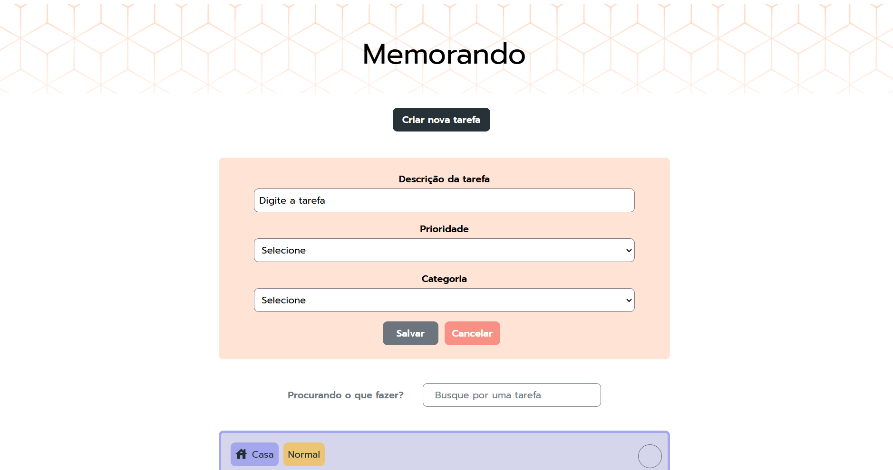

# Memorando

## ℹ️ Sobre

Projeto utilizado no curso para aprendizado das técnicas e melhores práticas.

## 📘Ementa

### Angular: torne sua aplicação interativa e personalizada com animações

- Aprender a utilizar o módulo de animações do Angular
- Entender como adicionar gatilhos nos elementos do template com o método trigger
- Saiber como animar diferentes estados do elemento com os métodos state e style
- Aplicar diferentes formas de adicionar animações às transições de estado do elemento com os métodos transition e animate
- Conhecer os estados reservados void e coringa
- Animar elementos que não estão anexados ao DOM com :enter e :leave

### Angular: aprimore suas técnicas de animação e crie interfaces ainda mais atraentes

- Adicionar estilos intermediários às animações com keyframes
- Personalizar a velocidade e aceleração usando cubic-bezier
- Criar animações simultâneas com group
- Animar elementos aninhados com query
- Atualizar dados da aplicação utilizando BehaviorSubject
- Sequenciar suas animações com stagger
- Desabilitar animações quando necessário

## 🖥️ Tecnologias

  
  
  

## 🧑‍🏫 Instrutor(es)

| [ Nayanne Batista](https://github.com/nayannelbatista) |
| :------------------------------------------------------------------------------------------------------------------------------------------------------------: |

## 💻 Screenshot

